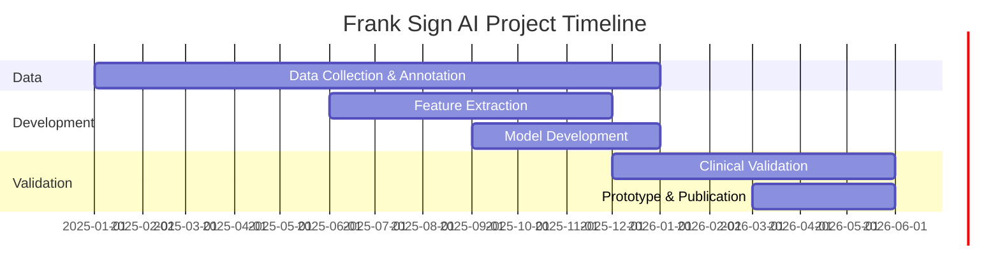

# Project Roadmap

> Aligned with TÜBİTAK 1005 Project Milestones (18-month project)

## Overview

---

## Phase 1: Data Collection & Annotation
**Timeline**: Month 1-12 (Current Phase)

### Goals
- [ ] Collect 1000+ participant images with clinical data
- [x] Set up CVAT annotation schema (13 label types)
- [x] Complete pilot annotation (121 images)
- [ ] Develop annotation guide for inter-rater reliability
- [ ] Achieve κ > 0.75 inter-rater agreement

### Current Status (January 2026)
- ✅ CVAT project created with full label schema
- ✅ 121 pilot images annotated
- 🔄 Ruler-based imaging protocol established
- ⏳ Clinical data collection in progress at hospital

### Key Metrics
| Metric | Target | Current |
|--------|--------|---------|
| Total participants | 1000+ | 121 (pilot) |
| Image quality (BRISQUE) | < 35 | TBD |
| Inter-rater Kappa | > 0.75 | TBD |

---

## Phase 2: Feature Extraction & Algorithm Development
**Timeline**: Month 6-15

### Goals
- [ ] CVAT XML parser for all label types
- [ ] Geometric feature extraction (5 features)
  - [ ] Length (arc length in mm)
  - [ ] Curvature (discrete curvature)
  - [ ] Tortuosity (arc/euclidean ratio)
  - [ ] Depth (from contour analysis)
  - [ ] Localization (normalized coordinates)
- [ ] Ruler detection for dimensional calibration
- [ ] Bilateral ear normalization
- [ ] Feature validation (Pearson r > 0.90 vs manual)

### Deliverables
- Python package: `src/franksign/data/`
- Feature matrix CSV for all annotated images
- Quality control report

---

## Phase 3: Model Development
**Timeline**: Month 9-16

### Experimental Design (Per Proposal Section 4.3.2)
Three-branch approach with baseline for comparison:

| Branch | Model | Purpose |
|--------|-------|---------|
| Baseline | Canny Edge Detection | Reference point, interpretable |
| **Main** | **Attention U-Net** | Primary segmentation model |
| Efficient | MAEF-Net | Lightweight, edge deployment |
| Visionary | Mamba-UNet (SSM) | Long-range dependencies |

### Goals
- [ ] Branch 1: Classical CV baseline (Canny edge detection)
- [ ] Branch 2: Attention U-Net (primary CNN model)
- [ ] Branch 3: MAEF-Net (resource-efficient alternative)
- [ ] Branch 4: Mamba-UNet exploration (State Space Model)
- [ ] XAI integration (Grad-CAM++, SHAP)
- [ ] Risk prediction model (geometric + clinical features)

### Success Criteria
| Model | Metric | Target |
|-------|--------|--------|
| Segmentation (Attention U-Net) | Dice | > 0.85 |
| Segmentation (Attention U-Net) | IoU | > 0.75 |
| Canny Baseline | Dice | > 0.50 |
| Risk Prediction | AUC | > 0.85 |

---

## Phase 4: Clinical Validation
**Timeline**: Month 14-18

### Goals
- [ ] Prospective validation (150-200 new patients)
- [ ] Inter-rater reliability vs AI
- [ ] Robustness testing (domain shift, adversarial)
- [ ] Fairness analysis (demographic subgroups)
- [ ] Usability study (SUS > 70)

---

## Phase 5: Prototype & Publication
**Timeline**: Month 16-18

### Goals
- [ ] Web-based clinical decision support prototype (TRL-5)
- [ ] Q1/Q2 journal publication submission
- [ ] Patent application
- [ ] Conference presentations

---

## Risk Mitigation

| Risk | Mitigation Strategy |
|------|---------------------|
| Insufficient participants | Partner with additional clinics |
| Low image quality | Strict acquisition protocol, augmentation |
| Model underperformance | Fallback to nnU-Net; focus on XAI |
| Clinical adoption barriers | Early clinician involvement |

---

## How to Update This Roadmap

1. Check off completed items with `[x]`
2. Update status indicators: ✅ ⏳ 🔄 ❌
3. Update "Current Status" section monthly
4. Add experiment results to `docs/experiments/`
5. Log changes in `CHANGELOG.md`
